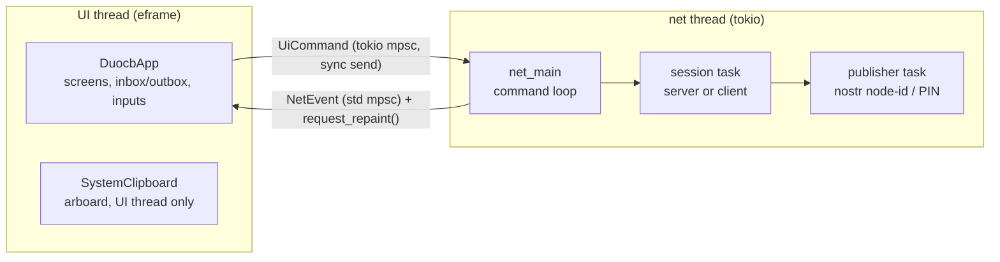

# duocb Architecture

duocb is a two-device P2P clipboard-sharing desktop app: an **egui** front end over a **tokio** networking runtime that pairs two iroh endpoints (QUIC/TLS 1.3), authenticates in-band, and then pumps clipboard items over one long-lived bidirectional stream. Signaling (how the client learns the server's ephemeral node id) is either **nostr** (token-derived or PIN-derived rendezvous records) or **manual** (a typed node id, resolved via mDNS on a LAN — no internet needed).

The transport/signaling/auth stack is a port of [duopipe](../../duopipe)'s peer runtime with the SOCKS payload replaced by a clipboard message stream and the ratatui TUI replaced by egui. Domain separation is complete: ALPN `duocb/1` and `duocb:*` KDF salts/tags, so duocb and duopipe peers can never interoperate or collide on relays.

## Contents

- [Module map](#module-map)
- [Threading model: UI ↔ runtime](#threading-model-ui--runtime)
- [Sessions and connection lifecycle](#sessions-and-connection-lifecycle)
- [Wire protocol](#wire-protocol)
- [Signaling](#signaling)
- [Authentication](#authentication)
- [Key derivations](#key-derivations)
- [Endpoint and discovery](#endpoint-and-discovery)
- [Clipboard handling](#clipboard-handling)
- [Persistence](#persistence)
- [Security model](#security-model)
- [Limitations](#limitations)

## Module map

```
src/
  main.rs          eframe bootstrap (window, run_native)
  protocol.rs      length-prefixed JSON framing; auth/PIN control messages; ClipMsg
  auth.rs          47-char token: generate / validate (CRC16) / fingerprint (SHA-256/8-hex)
  pin.rs           Crockford-base32 PIN, check digit, 60s buckets, Argon2id KDFs
  pin_auth.rs      in-band mutual PIN challenge-response (NIP-44 sealed proofs)
  nostr.rs         kind-30078 token/name discovery; kind-9421 PIN rendezvous
  clipboard.rs     arboard wrapper (one long-lived instance, lazy init)
  config.rs        optional ~/.config/duocb/config.toml (token-mode form prefill)
  net/
    mod.rs         UiCommand / NetEvent / ConnStatus enums; EventSender; runtime spawn
    endpoint.rs    iroh endpoint builders, connect, ConnPath snapshot + debug path logger (ALPN duocb/1)
    runtime.rs     command loop, server/client sessions, PairClaim, auth, clip pump
  ui/
    mod.rs         Screen / PairMode / ClipItem (CRC-32, peek + auto-hide)
    app.rs         eframe::App: event drain, state, keyboard shortcuts, connection-path modal
    screens.rs     home / start / join screens
    session.rs     paired panel: send + connection-path buttons, outbox, inbox with peek/copy/clear
```

## Threading model: UI ↔ runtime

eframe owns the main thread; a dedicated thread runs a tokio multi-thread runtime. The two sides share **no mutable state** — channels only:



- **UI → runtime:** `tokio::sync::mpsc::unbounded_channel<UiCommand>` — `StartServer{mode}`, `StopServer`, `Connect{spec}`, `Disconnect`, `SendClipboard{text}`, `QueryConnPath`, `Shutdown`. Unbounded senders are synchronous, so the UI thread never blocks.
- **Runtime → UI:** `std::sync::mpsc::channel<NetEvent>`; every send is followed by `egui::Context::request_repaint()` so the GUI wakes even when idle. `DuocbApp` drains the receiver at the top of each frame.
- **Events:** `ServerReady{node_id, manual_token?, token_fingerprint?}`, `PinRotated{pin_display, seconds_left}` / `PinCleared`, `Status(ConnStatus)`, `PeerPaired` / `PeerDisconnected`, `ConnPath(paths)`, `ItemReceived{text}` / `ItemSent`, `Error(message)`.
- **Shutdown:** window close → `UiCommand::Shutdown` → the runtime cancels its session (connection closed with code 0, endpoints closed) and returns; the UI joins the thread.

The `EventSender`'s repaint context is optional, so the whole runtime runs headless in integration tests (`net/runtime.rs` tests pair two real endpoints in-process).

## Sessions and connection lifecycle

`net_main` owns **at most one session** (server *or* client); starting a new one cancels and replaces the current one. A session owns a `CancellationToken`, a task handle, and the `clip_tx` channel that feeds outbound clipboard items into whatever connection is currently live.

**Server session** (`run_server_session`):

1. Create the listening endpoint (fresh ephemeral identity) → emit `ServerReady` (manual mode generates its one-time token here) → `Listening`.
2. Spawn the mode's signaling publisher (see below); manual mode has none.
3. Accept loop, **one connection served at a time**: accept → accept the single session stream and `auth_as_listener` on it → `PeerPaired` → pump clipboard on that same stream until the connection dies → `PeerDisconnected`, keep listening.
4. A `PairClaim` (below) restricts the whole session to one peer identity.

**Client session** (`run_client_session`) — resolve/connect/auth loop with reconnect:

1. Resolve the target **each attempt**: manual = the typed node id; token mode = nostr lookup by name (so a restarted server with a fresh node id self-heals); PIN mode = nostr rendezvous lookup, with a **pinned node id fast path** after the first pairing (the PIN has rotated off the relays, but the server retains our pairing key, so reconnects dial the remembered id and re-prove the same PIN in-band).
2. Self-dial guard, then connect (10 s timeout) → open the single session stream, auth on it → `Connected` → pump on the same stream.
3. On a drop: reconnect with exponential backoff (1 s → ×2 → 30 s cap), unlimited after the first success, 10 attempts before it. **Auth failures are fatal** — the credential won't get better on its own; the session ends and the error is surfaced.

## Wire protocol

Per connection (client = dialer), a **single** QUIC bidirectional stream carries both phases in order:

1. **Auth** runs first: `AuthRequest` (`method` tag selects `Token{auth_token}` or `Pin{nonce}`) and the corresponding response flow. 10 s timeout, close codes: `1` auth failed, `2` auth timeout, `0` clean shutdown.
2. **Clipboard** — on success the *same* stream stays open (the send side is never `finish`ed) and carries any number of `ClipMsg{text, sent_at_ms}` frames in both directions for the life of the connection.

There is no separate control channel and no `Hello` handshake: a clipboard app has exactly one data stream, so the two-stream split inherited from the multiplexed duopipe/flextunnel tunnel earns nothing here (auth succeeding already proves the stream is open and bidirectional). Collapsing to one stream saves a stream-open and a round-trip per connection.

**Framing:** 4-byte big-endian length prefix + JSON body, with a `version` field validated on decode (`DUOCB_PROTO_VERSION = 1`) and strict frame boundaries (trailing bytes rejected). Two size caps applied per read by phase: auth/control frames 16 KiB, clipboard frames **1 MiB** (checked against the *encoded* frame). Oversize on send is rejected locally with an error event — nothing hits the wire and the session lives on; an oversize length prefix on receive is a protocol error that drops the connection.

There is no application-level keepalive: QUIC keep-alives (15 s) and the idle timeout (30 s) provide liveness, and the pump ends when the stream read fails — so an ungracefully dropped peer is reaped within ~30 s and the reconnect path takes over.

The pump (`pump_clipboard`) runs the writer (drain `clip_rx` → encode → write) and reader (read frame → `ItemReceived`) as two independent futures over the stream's send/recv halves — no `select!` over a partial frame read, so framing can't be corrupted by cancellation.

## Signaling

Both nostr schemes publish only the server's **ephemeral node id**, NIP-44 (v2) self-encrypted; no token is ever placed on a relay. Default relays: `nos.lol`, `relay.nostr.net`, `relay.primal.net`, `relay.snort.social`.

### Token + name (kind 30078, parameterized-replaceable)

- Both peers derive the **same nostr keypair** from the shared auth token: `SecretKey = SHA-256("duocb:nostr-rendezvous:v1" ‖ token)`.
- The `d` tag namespaces peers sharing one token: `duocb:nodeid:<hex SHA-256("duocb:peer-id:v1" ‖ token ‖ name)>` — salted with the token so short names can't be enumerated.
- The server publishes on start, re-checks/republishes quickly for the first ~minute, then every 300 s (replaceable events can be dropped by relays). If a lookup shows a **different live node id** under our name, another device took the name: the publisher stops and surfaces an error (the existing connection is unaffected).
- The client looks the record up **on every connect attempt** and decrypts with the same derived key.

### PIN quick pair (kind 9421, regular events with NIP-40 expiry)

- Every 60 s bucket the server mints a fresh 8-char Crockford PIN (7 random chars ≈ 35 bits + a position-weighted check digit that rejects typos at input time).
- Both sides derive a per-`(pin, bucket)` nostr keypair via **Argon2id** (64 MiB, t=3) with salt `"duocb:pin-rendezvous:v1" ‖ bucket_be`; the record is found by **author key alone** — only a PIN holder can derive it.
- Records expire after 3 buckets (NIP-40), and the client searches buckets `{cur, cur−1, cur+1}` in one query, so a code read late or across a rotation boundary still resolves.
- The publisher stops (and the UI clears the code) the moment a peer pairs — no more peers will be accepted that session.

### Manual / offline

No signaling. The server displays its node id + a generated one-time token; the client types both. Resolution of the bare node id falls to the endpoint's discovery services — on a LAN, **mDNS**, which is why this mode works with zero internet. This fixes the corresponding duopipe gap where the manual path had no interactive way to share the listener's token: in duocb the server *generates and displays* the token and the client form has a field for it.

## Authentication

Knowing a node id never suffices; every connection authenticates on the session stream before any clipboard frame flows.

**Token method** (token + manual modes): the client sends `AuthRequest::Token{auth_token}`; the server checks membership in its accepted set and replies `AuthResponse{accepted, reason}`. Tokens are 47 chars: `d` + base64url(32 random bytes + CRC16-CCITT-FALSE), with an 8-hex-digit SHA-256 fingerprint shown in the UI so both devices can confirm they hold the same token without re-revealing it.

**PIN method**: a 4-message mutual challenge-response on the session stream —

```text
C→S: AuthRequest::Pin { nonce_c }
S→C: PinChallenge     { nonce_s }
C→S: PinResponse      { proof_c }            proof_c = seal(k, "dialer"   | nonce_c | nonce_s)
S→C: PinConfirm       { accepted, proof_s }  proof_s = seal(k, "listener" | nonce_c | nonce_s)
```

`k` is derived from the PIN string alone (Argon2id, salt `"duocb:pin-auth:v1"` — deliberately bucket-independent so the client never guesses the bucket), and `seal` is NIP-44 self-encryption whose MAC makes a wrong-PIN proof unverifiable. Direction strings and both nonces prevent replay across directions and handshakes; verification is constant-time. The server checks the proof against its recent buckets' keys (last 3) plus, for a reconnecting paired peer, the exact key it originally paired with.

**PairClaim — one pair per server session:** the first authenticated node id claims the endpoint; every other node id is refused **in-band** (a proper rejection, not a connection drop), and the claim is committed *before* the acceptance frame is written so a race loser is never told "accepted" then dropped. The claim intentionally survives the peer's disconnects — that peer (and only it) reconnects freely — but a *restarted* peer has a fresh ephemeral identity and is refused; the UI error says to stop/start the server to re-pair. Because the server closes a rejected connection immediately, the rejection frame can lose the race to the close: the client also maps application close codes 1/2 to the same fatal auth error.

## Key derivations

| Purpose | Function | Input | Notes |
|---|---|---|---|
| nostr identity (token mode) | SHA-256 | `"duocb:nostr-rendezvous:v1"` ‖ token | same keypair on both peers |
| record `d` tag (token mode) | SHA-256 | `"duocb:peer-id:v1"` ‖ token ‖ name | token-salted name hash |
| PIN rendezvous key | Argon2id 64 MiB/t3 | PIN, salt `"duocb:pin-rendezvous:v1"` ‖ bucket | per-bucket nostr keypair |
| PIN auth key | Argon2id 64 MiB/t3 | PIN, salt `"duocb:pin-auth:v1"` | bucket-independent, distinct domain |
| token fingerprint | SHA-256 (first 4 bytes) | token string | 8 lowercase hex digits, display only |

Argon2id makes the ~35-bit PIN expensive to brute-force offline from a captured relay record, and the 60 s rotation + 180 s record TTL bound the window; even a cracked record yields only a node id, never a credential.

## Endpoint and discovery

`net/endpoint.rs` builds both endpoints identically (`Endpoint::builder(presets::Empty)` with an explicit ring crypto provider — required by iroh 1.0 on the Empty preset):

- ALPN `duocb/1` (server side only; a mismatch fails the QUIC handshake).
- Transport: idle timeout 30 s (prompt dead-peer reaping), keep-alive 15 s; default congestion control.
- Relays: `RelayMode::Default` (n0 public relays as fallback path).
- Discovery/address lookup: n0 pkarr publisher + DNS resolver, **plus mDNS always** — the offline path. The client dials a **bare `EndpointAddr::new(node_id)`**; iroh resolves actual addresses via these services and hole-punches, falling back to a relay.
- The identity is never persisted: every session is a fresh Ed25519 key, so node ids (and everything derived from them) are per-run.

Connection-path status is **pulled on demand**, not watched: `connection_paths(conn)` returns a point-in-time snapshot of the connection's paths (`ConnPath { kind, display, selected }`) — `Connection::paths()` is itself a snapshot, so no background task is involved. The UI's "Connection path" button issues `QueryConnPath`, the runtime answers with `ConnPath(paths)` read from the live connection, and the result is shown in a dismissible modal. A separate background watcher exists **only for logging** the selected path and its changes (relay → direct); it is spawned only when debug logging is enabled (`RUST_LOG=duocb=debug`) and logs at `debug!`, so normal runs are quiet.

## Clipboard handling

- One **long-lived, lazily created** `arboard::Clipboard` lives on the UI thread for the whole process. On X11, clipboard ownership belongs to the providing connection — a per-operation instance would lose the copied text the moment it dropped.
- Reads/writes happen directly on the UI thread on button press (text selections are sub-millisecond IPC); failures (e.g. a huge INCR transfer) surface as a dismissible error banner and never affect the connection.
- **Receive side:** items go into a `Vec<ClipItem>` in app memory, newest first, capped at the **last 5** (older ones drop). Each item shows metadata only until peeked — size hint, a CRC-32 fingerprint (computed once on arrival), and the received time — so the two devices can compare an item without revealing it. *Peek* renders the text read-only, truncated past 4096 chars and auto-hidden after 15 s; *Copy* is the **only** code path that writes the system clipboard (and always yields the full, untruncated text). There is no auto-copy and no persistence.
- **Send side:** explicit action only (`Ctrl+S`/button reads the clipboard and sends). There is no clipboard watcher. The **last item sent** is kept in a one-slot outbox (same `ClipItem`, promoted from a pending buffer once `ItemSent` confirms it left the wire) and shown above the inbox with its size/CRC, so the receiver can confirm a match.

## Persistence

Exactly one optional file, `~/.config/duocb/config.toml` (`auth_token`, `my_name`, `peer_name`), written **only** by the explicit "Remember these settings" button and used to prefill the token-mode forms. A malformed config is ignored with a warning. Nothing else is stored: no identity keys, no peer list, no clipboard content, no inbox or outbox.

## Security model

- **Trust boundary:** the two devices. The pairing secret (token or PIN) is assumed to be transferred between your own devices over a channel you already trust.
- **Transport:** QUIC/TLS 1.3, authenticated by the peer's node id (its public key). The client always connects to exactly the id it typed or resolved.
- **Relays and signaling servers** (nostr relays, n0 infrastructure) see only ciphertext under secret-derived keys and standard QUIC metadata; they can't read node-id records without the token/PIN and can't pass auth even with them (auth is in-band, per-connection, replay-protected).
- **Debug hygiene:** the token is wrapped in a type whose `Debug` prints `AuthToken(***)`, so it can't leak through logs.

## Limitations

- Two devices, one pairing per server session — by design (duopipe's model).
- Text only; 1 MiB cap per item.
- A crashed peer is detected at the QUIC idle timeout (~30 s); clean disconnects propagate immediately.
- Multi-megabyte X11 INCR clipboard reads may fail (clean error, connection unaffected).
- The strict-offline path (manual mode with no internet) relies on mDNS being usable on the local network segment.
