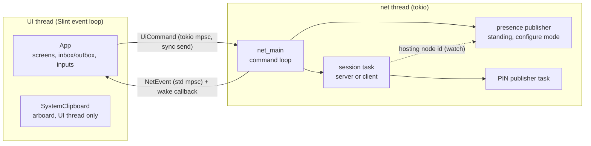

# duocb Architecture

duocb is a two-device P2P clipboard-sharing desktop app: a **Slint** front end over a **tokio** networking runtime that pairs two iroh endpoints (QUIC/TLS 1.3), authenticates in-band, and then pumps clipboard items over one long-lived bidirectional stream. Signaling (how the client learns the server's ephemeral node id) is either **nostr** (token-derived or PIN-derived rendezvous records), local-network PIN discovery, or **manual** (a single out-of-band pairing code containing the node id and session secret; the node id resolves via mDNS on a LAN with no internet).

The transport/signaling/auth stack is a port of [duopipe](../../duopipe)'s peer runtime with the SOCKS payload replaced by a clipboard message stream and the ratatui TUI replaced by a Slint GUI. Domain separation is complete: ALPN `duocb/1` and `duocb:*` KDF salts/tags, so duocb and duopipe peers can never interoperate or collide on relays.

## Contents

- [Threading model: UI ↔ runtime](#threading-model-ui--runtime)
- [Sessions and connection lifecycle](#sessions-and-connection-lifecycle)
- [Wire protocol](#wire-protocol)
- [Signaling](#signaling)
- [Authentication](#authentication)
- [Key derivations](#key-derivations)
- [Endpoint and discovery](#endpoint-and-discovery)
- [Clipboard handling](#clipboard-handling)
- [Persistence](#persistence)
- [Security model](#security-model)
- [Limitations](#limitations)

## Threading model: UI ↔ runtime

Slint's event loop owns the main thread; a dedicated thread runs a tokio multi-thread runtime. The two sides share **no mutable state** — channels only:



- **UI → runtime:** `tokio::sync::mpsc::unbounded_channel<UiCommand>` — `StartServer{mode}`, `StopServer`, `Connect{spec}`, `Disconnect`, `SendClipboard{text}`, `QueryConnPath`, `SetPresence{identity?}`, `RefreshPeers`, `Shutdown`. Unbounded senders are synchronous, so the UI thread never blocks.
- **Runtime → UI:** `std::sync::mpsc::channel<NetEvent>`; every send is followed by the wake callback, which notifies a `tokio::sync::Notify`. A `slint::spawn_local` task on the event loop awaits that signal, drains the receiver, applies the events to `App`, and pushes the result into the UI through one idempotent `App::sync` projection (all rendering state lives in the `UiState` Slint global; the non-Send app state never leaves the main thread). A 500 ms heartbeat timer drives time-derived state: peek expiry, flashes, the PIN countdown, last-seen labels, and the device picker's 30 s auto-refresh.
- **Rendering:** the winit backend with Slint's **Skia** renderer (not the default femtovg), chosen for native-quality text: font lookup goes through CoreText / DirectWrite / fontconfig. `main.rs` pushes per-platform font families into the UI once at startup — `".SF NS"` (the San Francisco system font's hidden family name; the friendly aliases don't resolve) + Menlo on macOS, Segoe UI + Consolas on Windows, fontconfig defaults on Linux — and `DUOCB_UI_FONT` overrides the UI family. List properties (peers, inbox, connection paths) are diffed into their `VecModel`s row-by-row rather than replaced, so the heartbeat re-sync never re-instantiates unchanged rows.
- **Events:** `ServerReady{node_id, token_fingerprint?, pairing_code?}`, `ClientReady{node_id, token_fingerprint?}`, `PinRotated{pin_display, seconds_left}` / `PinCleared`, `Status(ConnStatus)`, `PeerPaired` / `PeerDisconnected`, `ConnPath(paths)`, `ItemReceived{text, pulled}` / `ItemSent`, `PeerList{peers}`, `PresenceConflict{message}`, `Error(message)`.
- **Presence publisher:** owned by `net_main`, independent of sessions. `SetPresence(Some(identity))` (issued by the UI once secret + name are configured) starts it; it broadcasts this device's presence record and keeps it fresh until `SetPresence(None)` (secret cleared) or shutdown. A configure-mode server session feeds its node id through a `tokio::sync::watch` channel; the publisher republishes immediately on change, so hosting state propagates without coupling the session to the publisher's lifetime. `RefreshPeers` spawns a one-shot fetch (at most one in flight) answered with `PeerList`.
- **Shutdown:** window close → `UiCommand::Shutdown` → the runtime cancels its session (connection closed with code 0, endpoints closed) and returns; the UI joins the thread.

The `EventSender`'s wake callback is optional, so the whole runtime runs headless in integration tests (`net/runtime.rs` tests pair two real endpoints in-process).

## Sessions and connection lifecycle

`net_main` owns **at most one session** (server *or* client); starting a new one cancels and replaces the current one. A session owns a `CancellationToken`, a task handle, and the `clip_tx` channel that feeds outbound clipboard items into whatever connection is currently live.

**Server session** (`run_server_session`):

1. Create the listening endpoint (fresh ephemeral identity) → in manual mode generate a session secret, cache its PIN-auth key, and bundle it with the node id as one pairing code → emit `ServerReady` → `Listening`.
2. Signaling: configure mode publishes its node id into the hosting watch channel (a drop-guard clears it on every exit path), and the standing presence publisher carries it to the relays; PIN mode spawns its rotating-PIN publisher; manual mode has none.
3. Accept loop, **one connection served at a time**: `accept_serveable` accepts the single session stream and `auth_as_listener` on it → `PeerPaired` → pump clipboard on that same stream until the connection dies → `PeerDisconnected`, keep listening. The accept keeps running *during* the pump: any dialer that isn't the claimed peer is refused immediately with a `SERVER_BUSY` close (its node id is QUIC/TLS-authenticated, so no in-band auth is needed to turn it away), and a fresh connection from the *paired* peer preempts the current one — a seamless reconnect that doesn't wait on the dead connection's ~30 s idle timeout.
4. A `PairClaim` (below) restricts the whole session to one peer identity; it also gates `accept_serveable`, so a busy or already-paired server turns away every other dialer promptly rather than leaving it to hang.

**Client session** (`run_client_session`) — resolve/connect/auth loop with reconnect:

1. Resolve the target **each attempt**: manual = the node id parsed from the pasted pairing code; configure mode = look up the **selected peer's** presence record by its exact identity tag and dial the node id inside (so a restarted host with a fresh node id self-heals; a missing hosting id is retried and counts toward the attempt bound); PIN mode = rendezvous lookup on the selected internet/LAN channels, with a **pinned node id fast path** after the first pairing (the PIN has rotated out of discovery, but the server retains our pairing key, so reconnects dial the remembered id and re-prove the same PIN in-band).
2. Self-dial guard, then connect (10 s timeout) → open the single session stream, auth on it → `Connected` → pump on the same stream.
3. On a failed or dropped attempt: **fixed-interval reconnect** — retry every 3 s, giving up after `MAX_CONNECT_ATTEMPTS` (10) *consecutive* failures with a surfaced error. The counter resets to zero on any successful connection, so the bound applies uniformly (a dropped session never retries without end) yet a flaky-but-recovering link never trips it. **Auth failures are fatal** — the credential won't get better on its own; the session ends and the error is surfaced. A `SERVER_BUSY` close from an already-paired server is treated the same way (fatal, no retry).

## Wire protocol

Per connection (client = dialer), a **single** QUIC bidirectional stream carries both phases in order:

1. **Auth** runs first: `AuthRequest` (`method` tag selects `Token{auth_token}` or `Pin{nonce}`) and the corresponding response flow. 10 s timeout, close codes: `1` auth failed, `2` auth timeout, `3` server busy (already paired with another device — sent before any stream is accepted), `0` clean shutdown.
2. **Clipboard** — on success the *same* stream stays open (the send side is never `finish`ed) and carries any number of v2 `ClipMsg` frames in both directions. `ClipBody` is tagged as `Item{text, sent_at_ms}`, `PullLatest`, or `Latest{text, sent_at_ms}`; the latter two recover each side's most recent sent item after a reconnect.

There is no separate control channel and no `Hello` handshake: a clipboard app has exactly one data stream, so the two-stream split inherited from the multiplexed duopipe/flextunnel tunnel earns nothing here (auth succeeding already proves the stream is open and bidirectional). Collapsing to one stream saves a stream-open and a round-trip per connection.

**Framing:** 4-byte big-endian length prefix + JSON body, with a `version` field validated on decode (`DUOCB_PROTO_VERSION = 2`) and strict frame boundaries (trailing bytes rejected). Two size caps applied per read by phase: auth/control frames 16 KiB, clipboard frames **1 MiB** (checked against the *encoded* frame). Oversize on send is rejected locally with an error event — nothing hits the wire and the session lives on; an oversize length prefix on receive is a protocol error that drops the connection.

There is no application-level keepalive: QUIC keep-alives (15 s) and the idle timeout (30 s) provide liveness, and the pump ends when the stream read fails — so an ungracefully dropped peer is reaped within ~30 s and the reconnect path takes over.

The pump (`pump_clipboard`) runs the writer (drain `clip_rx` → encode → write) and reader (read frame → `ItemReceived`) as two independent futures over the stream's send/recv halves — no `select!` over a partial frame read, so framing can't be corrupted by cancellation.

## Signaling

Both nostr schemes publish NIP-44 (v2) self-encrypted content; no token is ever placed on a relay. Default relays: `nos.lol`, `relay.nostr.net`, `relay.primal.net`, `relay.snort.social`.

### Configure-mode presence (kind 30078, parameterized-replaceable)

- All devices sharing the secret derive the **same nostr keypair** from it: `SecretKey = SHA-256("duocb:nostr-rendezvous:v1" ‖ token)`. Authorship under that key is the proof of secret possession — every presence record is effectively signed by the secret.
- Each device has a collision-resistant display identity `<name>_<suffix>` (`crate::identity`): a user-chosen short name (`A-Za-z0-9-`, ≤ 24 chars) plus a permanent random 8-char suffix from an unambiguous mixed-case alphabet (no `0 O o 1 l I`), minted on first launch. Devices may freely share short names; an exact random-suffix collision is possible in principle but negligible at the intended device count.
- One **presence record** per device, `d` tag `duocb:presence:<hex SHA-256("duocb:presence-id:v1" ‖ token ‖ identity)>` — salted with the token so identities can't be enumerated. The encrypted payload is JSON: `{version, name, suffix, run_id, node_id?}` — the plaintext display name (readable only by token holders), the stable suffix, a random per-publisher-run id, and, while hosting, the current ephemeral node id. One record serves both presence ("this device exists, last seen at `created_at`") and rendezvous ("dial this node id").
- The standing publisher runs whenever secret + name are configured: a quick startup burst (6 × 10 s), then a 120 s heartbeat, plus an immediate republish when the hosting state changes. After the first publish it re-reads its own tag; a record carrying a **foreign `run_id`** means another live process is publishing as this device — it emits `PresenceConflict` and stops rather than fight over the record.
- The peer list is fetched by **author key alone** and decoded client-side: records older than 7 days are dropped, the newest record per **suffix** wins (a renamed device's old-identity record disappears), and this device's own suffix is excluded. Each row shows the record's raw age, deliberately **not** an online/offline verdict — relay timing is too unreliable to derive one, so nothing is gated on it: any listed device may be joined, the dial re-resolves the record on every retry, and the iroh dial is the actual liveness check. The joiner picks a specific device from this list; nothing is auto-selected.

### PIN quick pair (kind 9421, regular events with NIP-40 expiry)

- Every 60 s bucket the server mints a fresh 8-char Crockford PIN (7 random chars ≈ 35 bits + a position-weighted check digit that rejects typos at input time).
- Both sides derive a per-`(pin, bucket)` nostr keypair via **Argon2id** (64 MiB, t=3) with salt `"duocb:pin-rendezvous:v1" ‖ bucket_be`; the record is found by **author key alone** — only a PIN holder can derive it.
- Records expire after 3 buckets (NIP-40), and the client searches buckets `{cur, cur−1, cur+1}` in one query, so a code read late or across a rotation boundary still resolves.
- The publisher stops (and the UI clears the code) the moment a peer pairs — no more peers will be accepted that session.

### Manual / offline

No signaling. The server generates a PIN-shaped session secret and displays one pairing code containing both its node id and that secret (`<64-hex-node-id>-XXXX-XXXX`). The user copies the whole code over a trusted channel and pastes it into one client field. The client parses the embedded node id, dials it, and proves the embedded secret with the same mutual PIN challenge-response used by quick pair; no auth token exists in this mode. The code stays valid for the whole server session so the paired peer can reconnect after a drop. Resolution of the bare node id carried inside the code falls to the endpoint's discovery services — on a LAN, **mDNS**, which is why this mode works with zero internet.

## Authentication

Knowing a node id never suffices; every connection authenticates on the session stream before any clipboard frame flows.

**Token method** (configure mode only): the client sends `AuthRequest::Token{auth_token}`; the server checks membership in its accepted set and replies `AuthResponse{accepted, reason}`. Tokens are 47 chars: `d` + base64url(32 random bytes + CRC16-CCITT-FALSE), with a 16-hex-digit SHA-256 fingerprint (grouped `xxxx-xxxx-xxxx-xxxx`) shown in the UI so both devices can confirm they hold the same token without ever revealing it. The token is never displayed in plain text: entry fields are masked, and the fingerprint appears as soon as the input passes length and checksum validation.

**PIN/session-secret method** (PIN quick pair and manual mode): a 4-message mutual challenge-response on the session stream —

```text
C→S: AuthRequest::Pin { nonce_c }
S→C: PinChallenge     { nonce_s }
C→S: PinResponse      { proof_c }            proof_c = seal(k, "dialer"   | nonce_c | nonce_s)
S→C: PinConfirm       { accepted, proof_s }  proof_s = seal(k, "listener" | nonce_c | nonce_s)
```

`k` is derived from the PIN-shaped secret string alone (Argon2id, salt `"duocb:pin-auth:v1"` — deliberately bucket-independent so a PIN client never guesses the rendezvous bucket), and `seal` is NIP-44 self-encryption whose MAC makes a wrong-secret proof unverifiable. Direction strings and both nonces prevent replay across directions and handshakes; the expected proof plaintext is compared in constant time. A PIN server checks its last three rotating keys; a manual server has one session-secret key. For either mode, a reconnecting paired peer can also use the exact key it originally paired with. No new application credential is negotiated: iroh's QUIC/TLS handshake independently establishes the connection's traffic-encryption keys, which are not derived from the PIN/session secret or nostr record.

**PairClaim — one pair per server session:** the first authenticated node id claims the endpoint; every other node id is refused **in-band** (a proper rejection, not a connection drop), and the claim is committed *before* the acceptance frame is written so a race loser is never told "accepted" then dropped. The claim intentionally survives the peer's disconnects — that peer (and only it) reconnects freely — but a *restarted* peer has a fresh ephemeral identity and is refused; the UI error says to stop/start the server to re-pair. In either PIN or manual mode, reconnecting therefore requires both the originally paired endpoint's private key (proved by QUIC/TLS) and the original secret-derived proof. Learning that PIN/session secret after the claim is committed is insufficient from any other endpoint identity and does not reveal past or current QUIC traffic keys. Because the server closes a rejected connection immediately, the rejection frame can lose the race to the close: the client also maps application close codes 1/2 to the same fatal auth error. A busy or already-paired server instead refuses *before* accepting any stream, so it never sends an in-band frame at all — the client relies solely on close code 3 (`SERVER_BUSY`), which it likewise treats as a fatal auth error and never retries.

## Key derivations

| Purpose | Function | Input | Notes |
|---|---|---|---|
| nostr identity (configure mode) | SHA-256 | `"duocb:nostr-rendezvous:v1"` ‖ token | same keypair on all devices |
| presence `d` tag (configure mode) | SHA-256 | `"duocb:presence-id:v1"` ‖ token ‖ identity | token-salted identity hash |
| PIN rendezvous key | Argon2id 64 MiB/t3 | PIN, salt `"duocb:pin-rendezvous:v1"` ‖ bucket | per-bucket nostr keypair |
| PIN/session-secret auth key | Argon2id 64 MiB/t3 | PIN-shaped secret, salt `"duocb:pin-auth:v1"` | bucket-independent, distinct domain |
| token fingerprint | SHA-256 (first 8 bytes) | token string | 16 lowercase hex digits, grouped `xxxx-xxxx-xxxx-xxxx`, display only |

A PIN rendezvous event is an offline guessing target: its author key and ciphertext let an attacker check a candidate `(PIN, bucket)` pair. Argon2id (64 MiB, t=3) makes each guess expensive, while 60 s rotation and the server retaining only the three most recent PIN keys limit a PIN's usefulness before the first pairing to roughly three minutes. NIP-40's 180 s expiry asks relays to remove stale records but cannot prevent an observer from archiving them. A successful guess reveals the PIN itself, which derives both the rendezvous key and the in-band authentication key; the event's encrypted payload contains only the ephemeral node id and no separate standing token. After pairing, `PairClaim` makes that recovered PIN insufficient by itself: a reconnect must also authenticate as the already-claimed iroh endpoint, and the independently negotiated QUIC traffic keys remain secret.

## Endpoint and discovery

`net/endpoint.rs` builds both endpoints (`Endpoint::builder(presets::Empty)` with an explicit ring crypto provider — required by iroh 1.0 on the Empty preset), tuned by the mode's `EndpointReadiness`:

- ALPN `duocb/1` (server side only; a mismatch fails the QUIC handshake).
- Transport: idle timeout 30 s (prompt dead-peer reaping), keep-alive 15 s; default congestion control.
- Relays + discovery, **except LAN-only**: `RelayMode::Default` (n0 public relays as fallback path) plus n0 pkarr publisher + DNS resolver **and mDNS**. The client dials a **bare `EndpointAddr::new(node_id)`**; iroh resolves actual addresses via these services and hole-punches, falling back to a relay.
- **LAN-only PIN (`EndpointReadiness::LanDirect`) touches no internet at all**: `RelayMode::Disabled` and *only* the mDNS address lookup — no relay, no n0 DNS/pkarr publish or resolve. Pairing is entirely mDNS discovery + a direct QUIC path, so this mode genuinely *uses* no internet rather than merely not requiring one. (Manual mode keeps the relay/DNS path, so its "no internet **needed** on a LAN" is the weaker, correct claim.)
- The identity is never persisted: every session is a fresh Ed25519 key, so node ids (and everything derived from them) are per-run.

Connection-path status is **pulled on demand**, not watched: `connection_paths(conn)` returns a point-in-time snapshot of the connection's paths (`ConnPath { kind, display, selected }`) — `Connection::paths()` is itself a snapshot, so no background task is involved. The UI's "Connection path" button issues `QueryConnPath`, the runtime answers with `ConnPath(paths)` read from the live connection, and the result is shown in a dismissible modal. A separate background watcher exists **only for logging** the selected path and its changes (relay → direct); it is spawned only when debug logging is enabled (`RUST_LOG=duocb=debug`) and logs at `debug!`, so normal runs are quiet.

## Clipboard handling

- One **long-lived, lazily created** `arboard::Clipboard` lives on the UI thread for the whole process. On X11, clipboard ownership belongs to the providing connection — a per-operation instance would lose the copied text the moment it dropped.
- Reads/writes happen directly on the UI thread on button press (text selections are sub-millisecond IPC); failures (e.g. a huge INCR transfer) surface as a dismissible error banner and never affect the connection.
- **Receive side:** items go into a `Vec<ClipItem>` in app memory, newest first, capped at the **last 5** (older ones drop). Each item shows metadata only until peeked — size hint, a CRC-32 fingerprint (computed once on arrival), and the received time — so the two devices can compare an item without revealing it. *Peek* renders the text read-only, truncated past 4096 chars and auto-hidden after 15 s; within the received-item flow, *Copy* is the **only** action that writes the system clipboard (and always yields the full, untruncated text). There is no auto-copy and no persistence.
- **Send side:** explicit action only (`Ctrl+S` on Windows/Linux, `⌘S` on macOS, or the button reads the clipboard and sends). There is no clipboard watcher. The **last item sent** is kept in a one-slot outbox (same `ClipItem`, promoted from a pending buffer once `ItemSent` confirms it left the wire) and shown above the inbox with its size/CRC, so the receiver can confirm a match. The runtime also retains that one item in memory for the session lifetime; whenever a stream reconnects, each side sends `PullLatest`, answers with `Latest` when it has something, and the receiving UI deduplicates a recovery delivery it already holds.

## Persistence

The default file is `duocb/config.json` under the platform's per-user config directory (`~/.config` on Linux, `~/Library/Application Support` on macOS, `%APPDATA%` on Windows) with the configure mode's three fields: `auth_token` (the standing secret), `my_name` (this device's short name), and `device_suffix` (the permanent 8-char identity suffix, generated on the first launch with this config file and never regenerated — it survives clearing the secret). The config is **per-machine**; copying it to another device is not supported. It is machine-managed JSON, not intended for hand editing. The setup wizard persists the secret as soon as it is generated/imported and the name as soon as it is confirmed; **Clear secret** (an explicit, confirmed action) removes only `auth_token`. `--config`/`-c` or `DUOCB_CONFIG` selects an alternative file; the CLI wins over the environment. The process holds an exclusive OS lock on the config file itself for its lifetime, so one resolved config cannot back two simultaneous local instances (and the file is guarded against accidental external edits while duocb runs) while two E2E instances with distinct config paths run independently — each minting its own suffix. Because the lock lives on the file, saves overwrite it in place through the held handle rather than via an atomic temp-and-rename; to keep crash safety each save first writes the complete new content to a flushed sibling `<config>.bak` and only then overwrites the config, so a crash mid-overwrite leaves the config torn but the backup whole, and load recovers from the backup (a config that is malformed with no usable backup is ignored with a warning and falls back to defaults). Nothing else is stored: no identity keys, no peer list, no clipboard content, no inbox or outbox.

The secret is never displayed in full: both the generation step and the hub render it as a mask ending in its last four characters — enough to spot-check that a paste into a place without fingerprint support took the right value — with an explicit "Copy secret" action (for onboarding the next device) plus the fingerprint. The running role screens retain an identity summary: this device's display identity, the secret fingerprint, both local and paired node ids once available, and — on the joiner — which device it is joining.

## Security model

- **Trust boundary:** the two devices. The pairing secret (token, PIN, or manual session secret) is assumed to be transferred between your own devices over a channel you already trust.
- **Transport:** QUIC/TLS 1.3, authenticated by the peer's node id (its public key). The client always connects to exactly the id carried by the manual code or resolved through discovery.
- **Relays and signaling servers** (nostr relays, n0 infrastructure) see ciphertext under secret-derived keys and standard QUIC metadata; without the token/PIN they cannot decrypt the presence records (which carry the plaintext device name **inside** the ciphertext) or pass in-band authentication. A configured device publishes its (encrypted) presence on a ~2-minute heartbeat whenever the app runs, so relay operators observe event timing and author-key activity — a deliberate footprint for the always-current device list. Before a server is claimed, a party that obtains the token or successfully guesses a current PIN has the corresponding in-band authentication credential, which is why token secrecy and the PIN KDF/rotation window matter. After the first pairing, the PIN alone is no longer sufficient: every connection is also bound to the already-claimed QUIC peer identity, and the PIN does not derive the QUIC traffic keys.
- **Debug hygiene:** the token is wrapped in a type whose `Debug` prints `AuthToken(***)`, so it can't leak through logs.

## Limitations

- Two devices, one pairing per server session — by design (duopipe's model).
- Text only; 1 MiB cap per item.
- A crashed peer is detected at the QUIC idle timeout (~30 s); clean disconnects propagate immediately.
- Multi-megabyte X11 INCR clipboard reads may fail (clean error, connection unaffected).
- The strict-offline path (manual mode with no internet) relies on mDNS being usable on the local network segment.
