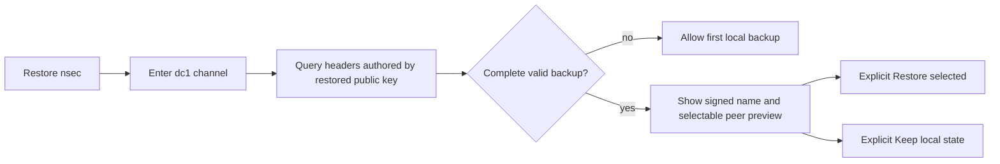

# duocb architecture

duocb separates three concerns that deliberately use different keys:

| Layer | Key lifetime | Purpose |
|---|---|---|
| Application identity | Persistent per installation | Signed identity cards, local trust, configure-mode wire authentication, Nostr authorship |
| iroh endpoint | Ephemeral per logical session | QUIC/TLS endpoint identity, signaling target, connection establishment |
| Directory channel | Optional, manually portable | Encrypted peer-list backup and signed-card discovery |

The directory channel never authenticates a connection. The application key is
never used as an iroh secret key. The iroh key never determines local trust.

## Workspace boundaries

- `duocb-core`: portable identity/card types, protocol framing, Nostr
  signaling/backups, PIN support, and the headless tokio runtime.
- `duocb`: Slint desktop app, local config, clipboard access, recovery UI.
- `duocb-ffi`: strict C surface for iOS; the hand-written header is
  `ios/duocb.h`.

The Slint event loop and tokio runtime communicate only with `UiCommand` and
`NetEvent` channels.

## Persistent identity and local trust

`auth::Identity` wraps a secp256k1/Nostr keypair:

- private encoding: NIP-19 `nsec`;
- public display encoding: NIP-19 `npub`;
- wire/trust key: the 32-byte public key.

An identity card is a signed kind `30382` Nostr event with a fixed identifier
and a versioned JSON body containing the validated device name. Parsing checks
the event signature, kind, identifier, schema, name rules, and 2 KiB size cap.

Each local peer entry is the full verified card, so the saved name is bound to
the public key. Trust is local and capped at 128 unique public keys. Neither a
directory result nor a backup is applied automatically.

## Configure-mode signaling

Starting a configure-mode server creates an iroh endpoint with a fresh
session-scoped key. For each locally trusted card, the host publishes a kind
`30385` parameterized replaceable event:

- author: host application key;
- `p` recipient: exactly one trusted application key;
- `d`: SHA-256 over a domain plus ordered host/peer public keys;
- content: NIP-44 encrypted `{version, node_id}`;
- NIP-40 expiry: five minutes.

The host refreshes these pairwise records while listening. A joiner queries the
selected trusted author and pair-specific identifier, decrypts with its
application key, and obtains the ephemeral iroh node id. No shared group
presence key or broadcast list exists.

This signaling only answers “where is the selected application identity
hosting now?” The subsequent wire handshake proves who is on the connection.

## Configure-mode authentication

Wire protocol version 3 removes token authentication. The dialer opens one
bidirectional QUIC stream:

```text
C → S  KeyRequest   {client application pubkey, nonce_c}
S → C  KeyChallenge {server application pubkey, nonce_s, signature_s}
C → S  KeyProof     {signature_c}
S → C  AuthResponse {accepted}
```

Before signing or accepting, both sides require the presented application key
to match a locally trusted card. Both signatures cover a domain-separated
transcript containing:

```text
protocol version
role = dialer | listener
client application key
server application key
nonce_c
nonce_s
client iroh node id
server iroh node id
```

The iroh ids come from the QUIC/TLS-authenticated connection, binding the proof
to this transport without treating the transport key as the persistent
identity. Nonces and roles prevent replay/reflection.

The server's one-peer claim stores the stable application public key in
configure mode. A reconnect may present a new iroh node id if it proves the same
trusted application key; the claim updates the transport id. Quick mode has no
application identity and continues to claim the session's iroh id.

## Directory backup and recovery

`DirectoryChannel` encodes 16 random bytes as:

```text
dc1.<22 base64url chars>.<3-char CRC16>
```

SHA-256 with a fixed domain derives a Nostr keypair used as the NIP-44
recipient/decryption key. The channel is portable but independent from the
application private key.

A backup body contains:

```text
version, generation, signed self-card, [signed peer cards]
```

Validation enforces:

- the self-card owner equals the event author and requested restored identity;
- at most 128 unique peers;
- no self entry;
- every card signature and schema;
- at most 128 KiB decoded.

Bodies are split into 8 KiB chunks, at most 16. Chunk records are kind `30384`;
headers are kind `30383`. Every chunk carries generation, slot, snapshot id,
index, and base64url data. The header commits the generation, peer count,
signed self-card, chunk count, snapshot SHA-256, and each chunk hash.

Generation parity selects one of two `d`-tag slots. Chunks publish first and the
header last, so a header is a commit point; the other slot retains a complete
fallback generation. Lookup tries newest complete generations first and ignores
partial, mismatched, duplicated, or undecryptable material.

### Restore state machine


```mermaid
flowchart LR
    A[Restore nsec] --> B[Enter dc1 channel]
    B --> C[Query headers authored by restored public key]
    C --> D{Complete valid backup?}
    D -- no --> E[Allow first local backup]
    D -- yes --> F[Show signed name and selectable peer preview]
    F --> G[Explicit Restore selected]
    F --> H[Explicit Keep local state]
```

Entering an existing channel sets a lookup-pending guard before any local
publish. A successful “not found” result allows the first backup. Confirming a
restore applies only selected cards and publishes a new generation reflecting
that selection. Rejecting the offer publishes the retained local state at a
generation newer than the discovered snapshot.

Kind `30383` headers also provide a bounded channel directory: decryptable
headers expose their owners' verified self-cards. The UI presents these as
untrusted candidates with an explicit Trust action.

## Quick mode

Quick PIN pairing is unchanged by the configure-mode identity migration. A
rotating Crockford PIN drives:

- Argon2id-derived rendezvous keys for Nostr and/or LAN discovery;
- a separate Argon2id-derived in-band mutual proof;
- mDNS/DNS-SD or an optional typed-IP unicast lookup in LAN-only mode.

Quick mode persists no application key, peer card, directory channel, iroh key,
PIN, or session.

## Runtime commands and events

Key configure commands:

- `StartServer::NostrKey { KeyIdentity }`
- `Connect::NostrKey { KeyIdentity, peer_public_key }`
- `PublishBackup { KeyIdentity }`
- `CheckBackup { identity, channel, relays }`
- `RefreshDirectory { channel, relays }`

Recovery events are data-only:

- `DirectoryCards { cards }`
- `BackupFound { snapshot: Option<BackupSnapshot> }`
- `BackupPublished { generation }`

The runtime never mutates caller-owned trust. Desktop and iOS decide whether to
trust a directory card or restore a snapshot.

## Persistence and bounds

Desktop config stores the application private key, optional signed self-card
and name, optional channel, signed peer cards, backup generation, and dirty
flag. Loading is strict: invalid or legacy data is an error, not a migration or
silent drop. Files are owner-only, protected by a sibling process-lifetime
lock, and atomically replaced through a flushed temporary file.

Clipboard content is never persisted. Inbox retention is five items in memory;
wire clipboard frames are capped at 1 MiB.

## Security assumptions

- Identity cards and backup channels are transferred over a path the owner
  trusts.
- Possession of a directory channel permits backup decryption but not wire
  authentication.
- Possession of an application private key permits impersonating that
  installation and decrypting pairwise records addressed to it.
- Nostr relays may omit, retain, reorder, or replay events. Signatures,
  generation selection, hashes, bounds, and explicit user confirmation make
  those behaviors fail closed or remain visible.
- iroh and relay infrastructure can observe connection/event metadata even
  though payloads are encrypted.
